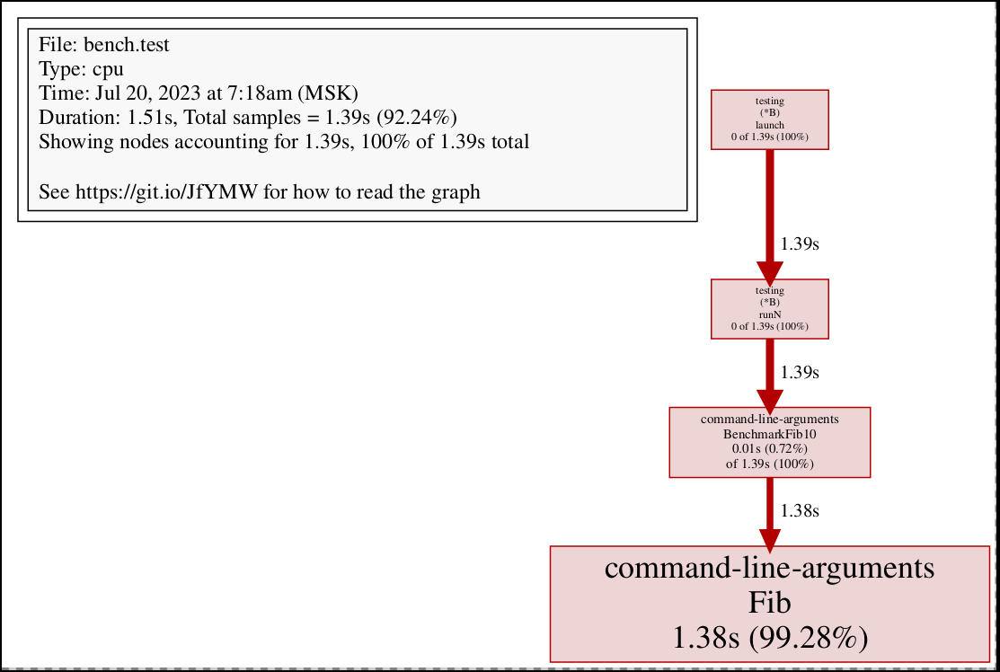

# Лекция 3. Интерфейсы, ошибки, паники
# methods

в обычном методе аргумент (p Path) передаётся просто по значению. "то значит, что тут нельзя написать какой-то метод, который сам путь меняет (например, нельзя trim или append)
````
import (
	"fmt"
	"math"
)
type Point struct{ X, Y float64}
func (p Point) Distance(q Point) float64{
	return math.Hypot(q.X-p.X, q.Y-p.Y)
}
type Path []Point
func (p Path) Distance() float64 {
	sum := 0.0
	for i := range p {
		if i > 0 {
			sum += p[i - 1].Distance(p[i])
		}
	}
	return sum
}
func main() {
	var p = Path{{1.0, 2.5}, {3.6, 3.8}, {4.5, 4.8},}
	fmt.Println(p.Distance())
	var p1 = Path{{1, 1}, {5, 1}, {5, 4}, {1, 1}, }
	fmt.Println(p1.Distance())
}
````
Метод м.б. определён не на самом типе, а на указателе на тип. И такорм случае аргумет является Pointer Receiver и смысл его в том, что он может сам объект поменять (может поменять сам тип, который передали по указателю). Особенность Go: в такой метод можно передать nil указатель, и такой метод продолжит работать нормально. Внутри такого метода можно проверить на nil и соответственно обработать, например:
````
type IntList struct {
	Value int
	Tail *IntList
}
func (list *IntList) Sum() int {
	if list == nil {
		return 0
	}
	return list.Value + list.Tail.Sum()
}
````
## Embedding
Методы взаимодействуют с эмбеддингом точно так же, как ембеддинг взаимодействует с полями. То есть: если у нас есть какая то структура (Point), мы можем её заимбеддить в другую структуру. Это значит: внутри новой структуры мы на отдельной строке должны указать имя типа, который эмбеддим, и не давать ему имени поля. 
````
type Point struct { X, Y float64}
type ColoredPoint struct {
	Point
	Color color.RGBA
}
````
В это момент все методы с Point переклеятся на нашу структуру ColoredPoint, и их можно будет позвать, как указано в примере (p.Distance). Но тут есть один момент: аргумент этого метода надо явно назад достать (q.Point)
````
type Point struct { X, Y float64}
type ColoredPoint struct {
	Point
	Color color.RGBA
}
red := color.RGBA{255, 0, 0,255}
blue := color.RGBA{, 0, 255, 255}
var p = ColoredPoint{Point{1, 1}, red}
var q = ColoredPoint{Point{5, 4}, blue}
fmt.Println(p.Distance(q.Point)) // 5
p.ScaleBy(2)
q.ScaleBy(2)
fmt.Println(p.Distance(q.Point)) // 10
````
Пример использования:
````
var cache = struct {
	sync.Mutex
	mapping map[string]string
} {
	mapping: make(map[string]string)
}
func Lookup(key string) string {
	cache.Lock()
	v := cache.mapping[key]
	cache.Unlock()
	return v
}
````
Из методов можно сделать функцию. В примере ниже мы захватили в ф-цию переменную p, и ф-ция стала ожидать только один аргумент q
````
p := Point{1, 2}
q := Point{4, 6}
distanceFromP := p.Distance
fmt.Println(distanceFromP(q))
var origin Point
fmt.Println(distanceFromP(origin))
scaleP := p.ScaleBy
scaleP(2)
scaleP(3)
scaleP(10)
````
## Method Values
````
type Rocket struct { /*...*/ }
func (r *Rocket) Launch() { /*///*/ }
r := new(Rocket)
time.AfterFunc(10 * time.Second, func90 { r.Launch() }) // эвивалентны, работают одинаково
time.AfterFunc(10 * time.Second, r.Launch) // эвивалентны, работают одинаково
````
## Method Expression
````
p := Point{1, 2}
q := Point{4, 6}
distance := Point.Distance  // method expression
fmt.Println(distance(p, q)) // "5"
fmt.Printf("%T\n", distance) // "func(Point, Point) float64"
````
В случае с методами, который принимают ресивер по указателю:
````
scale := (*Point).ScaleBy
scale(&p, 2)
fmt.Println(p) // "{2, 4}"
fmt.Printf("%T\n", scale) // "func(*Point, float64)"
````
Сеттеры и геттеры не приветствуются. 

Для изменения данных просто имя данных начинают с заглавной буквы

------------
------------
------------

# Go: Наследование и интерфейсы

- Композиция
- Встраивание
- Интерфейсы

В языке Go отсутствует понятие наследования в классическом виде (нет ключевого слова extends, как, например, в Java).

Однако терять преимущества, которые даёт механизм наследования, разработчики Go не хотели.

Поэтому всё тоже самое, что можно сделать в других языках программирования за счёт наследования классов, можно реализовать в Golang другими средствами.

Для начала определим, что даёт нам наследование:
1. Повторное использование кода: класс-наследник получает всё содержимое класса-предка и добавляет своё.
2. Динамический полиморфизм: переменная, у которой типом данных является некий базовый класс, может ссылаться как на объекты этого базового класса, так и на объекты его класса-наследника.
3. Динамическая диспетчеризация: Метод с одним и тем же названием может иметь разную реализацию в классе-предке и классе-наследнике.

В качестве элегантного решения проблемы повторного использования кода Golang предлагает использование композиции и встраивания.

Функционал полиморфизма и динамической диспетчеризации достигается за счёт использования интерфейсов.
## Композиция

Рассмотрим пример использования композиции в качестве инструмента повторного использования кода.

Допустим мы имеем структуру, которая описывает Машину (Сar).

Если нам необходимо получить все возможности структуры Car и дополнить их в классе Пожарная машина (FireEngine), то мы можем использовать композицию (сделать FireEngine членом Car):
````
type Car struct {
  // … содержимое
}

type FireEngine struct {
    basis Car
    // … дополнение
}
````
## Встраивание

Теперь рассмотрим решение проблемы повторного использования кода через Встраивание.

Допустим структура Car имеет метод Drive. Мы должны скопировать точное поведение метода Drive в структуре FireEngine.

Для этого мы можем применить делегирование:
````
type Car struct {
  // … содержимое
}

func (c *Car) Drive() { … }

type FireEngine struct {
    basis Car
    // … дополнение
}

func (fe *FireEngine) Drive() { fe.basis.Drive() }
````
Однако оно ведёт к дублированию кода. Поэтому имеет механизм Встраивание, что позволяет значительно сократить код:
````
type Car struct {
  // … содержимое
}

func (c *Car) Drive() { … }

type FireEngine struct {
    Car
    // … дополнение
}
````
## Интерфейсы

Теперь на очереди функционал полиморфизма и динамической диспетчеризации.

Допустим, что наше приложение расширяется и в ней появляется всё больше видов специализированных машин: Полицейская Машина (PoliceCar), Машина Скорой Помощи (AmbulanceCar), Поливомоечная машина (WateringCar).

Все они должны иметь метод Drive, однако реализует его каждая по-разному.

Например, PoliceCar едет со звуком сирены, а WateringCar во время поездки поливает дорогу водой.

То есть, мы должны определить "поведение", которое должно присутствовать в каждой из этих структур, но реализовано оно может быть по-разному.

В таком случае на сцену и выходят интерфейсы (interfaces).

Интерфейсы определяют, что тип делает, а не кем он является.

Методы должны отражать поведение типа, поэтому интерфейсы объявляются с набором методов, которые тип должен обязательно иметь (-able).

В нашем случае каждая из указанных выше структур должна иметь метод Drive.
````
type IDriveable interface {
  Drive()
}

type Car struct {
  // … 
}

type PoliceCar struct {
    // … 
}

func (c Car) Drive() {
    fmt.Println("Просто еду по дороге")
}

func (pc PoliceCar) Drive() {
    fmt.Println("Еду по дороге с мигалкой. Виу-виу!")
}

func main() {
  cars := []IDriveable{&Car{}, &PoliceCar{}}
  for _, vehicle := range cars {
      vehicle.Drive()
      // => Просто еду по дороге
      // =>  Еду по дороге с мигалкой. Виу-виу!
  }
}
````
Именование интерфейсов в виде "глагол + able" стандартно для большинства языков программирования.

Однако в Go интерфейсы именуются немного по-другому. В данном случае интерфейс должен называться Driver.

Подробнее про нейминг можно почитать в официальной документации Golang.

Так никакого явного указание реализации не требуется.

Любой тип, который предоставляет методы, которые указаны в интерфейсе, можно считать реализующим интерфейс.

# Interfaces
````
type Writer interface {
    Write(p []byte) (n int, err error)
}
````
## Embedding interfaces
````
package io
type Reader interface {
	Read(p []byte) (n int, err error)
}
type Closer interface {
	Close() error
}
type ReadWriter interface {
	Reader
	Writer
}
type ReadWriteCloser interface {
	Reader
	Writer
	Closer
}
````
Как пользоваться:

Можно создать переменную, у которой типом является Interface. Например, io.Writer. После этого этой переменной присвоить значение, которое удовлетворяет этому типу:
````
var w io.Writer
w = os.Stdout // OK: *os.File has Write method
w = New(bytes.Buffer) // OK: *bytes.Buffer has Write method
w = time.Second // compile error: time.Duration lacks Write method
````
### Особенности интерфейса:
Если у типа есть метод, определённый на указателе на этот тип, то мы можем вызвать этот метод как на указателе, так и на самом типе (происходит неявное приведение, неявное разыменование)

Но! На интерфейсе всё происходит иначе: не происходит неявного разыменования
````
package fmt
type Stringer interface {
	String() string
}
...
type IntSet struct { /*...*/ }
func (*IntSet) String() string
var s IntSet
var _=s.String() // OK: s is a variable and &s is a method
var _ fmt.Stringer = &s // OK
var _ fmt.Stringer = s // compiling error: InSet lacks String method
````
### interface{}
````
var any interface{}
any = true
any = 12.34
any = "hello"
any = map[string]int{"one":1}
any = new(bytes.Buffer)
````
### interface satisfaction
Что делать, если у меня есть где-то интерфейс, в другом пакете тип, и я хочу убедиться, что этот тип реализует этот интерфейс, потому что итерфейс могут поменять, а я забуду это поправить. Для этих целей мы в своём пакете на самом верхнем уровне создаёт переменную с названием "_" (переменная, к которой нельзя обратиться), у которой прописываем явный тип нужного нам интерфейса. Дальше туда присваиваем значение своего типа (для указателей - nil или new(..)). И получаем ошибку на самом раннем этапе компиляции
````
// *bytes.Buffer must satisfy io.Writer
var _ io.Writer = (*bytes.Buffer)(nil)
````
### interface values (реализация интерфейсов)
интерфейс состоит из двух указателей:
````
[указатель на конкретный тип (например *File)]
[указатель на ячейку памяти, где хранится значение переменной]
````
У nil в зависимости от контекста - разный смысл: если присвоить переменной интерфейса nil - в обе ячейки запишется nil, nil
````
var w io.Writer
w = os.Stdout
w = new(bytes.Buffer)
w = nil
````
А что будет, если присвоить этой переменной нулевой указатель данного типа?
````
var buf *bytes.Buffer // создаётся нулевой указатель на bytes.Buffer
if debug {
	buf = new(bytes.Buffer) // enable collection of output
}
f(buf) // NOTE: subtly incorrect!
/* If out is non-nul, output will be written to it/ */
func f(out io.Writer) {
	/* ... do something */
	if out != nil { // в нашем случае мы не присваивали переменной nil,
					// в её первой ячейке лежит указатель на тип, 
					// при этом значение не является нулевым, 
					// это не считается за нулевой интерфейс.
					// в нашем случае out всегда не равен nil
		out.Write([]byte("done!\n"))
	}
}
````
Как поправить наш пример? Изначально определить переменную как io.Writer, nогда её начальные значения будут nil, nil. И дальше её инициализировать, если надо
````
var buf io.Writer
if debug {
	buf = new(bytes.Buffer)
}
f(buf) // OK
````
## Что можно делать с интерфейсами?
#### - Если есть интерфейс, то можно вызывать метод на этом интерфейсе:
````
out.Write([]byte("done!\n")) // см пример выше
````
#### - Type Assertions (приведение интерфейса)
Это чем то похоже на приведение типов, только в начале мы пишем интерфейс - точка - новый тип
#### type assertiom Concrete type (на конкретный тип):
````
var w io.Writer
w = io.Stdout
f := w.(*os.File) // success: f == os.Stdout, мы угадали, внутри именно такой тип
c := w.(*bytes.Buffer) // panic: interface holds *os.File, not *bytes.Buffer
````
#### type assertion interface type (скастить интерфейс к другому интерфейсу):
То есть Go сходит к существующему интерфейсу и проверит, реализует ли он метод, который необходим новому интерфейсу? Если реализует - то ОК
````
var w io.Writer
w = io.Stdout
rw := w.(io.ReadWriter) // success: *os.File has both Read and Write
w = new(ByteCounter)
rw := w.(io.ReadWriter) // panic: *ByteCounter has no Read method
````
#### - Доставать тип интерфейса
Проверка (check type):
````
val, ok := w.(io.ReadWriter)
if ok {...}
````
````
var w io.Writer = os.Stdout
f, ok := w.(*os.File) // success: ok, f == os.Stdout
b, ok := w.(*bytes.Buffer) // failure: !ok, b == nil
````
### один интерфейс м.б. вложен в другой
При этом есть нюанс: в верхнем присваивании nil примется, в нижнем - будет паника
````
var w io.Writer
var rw io.ReadWriter
w = rw // OK: io.ReadWriter is assignable to io.Writer
w = rw.(io.Writer) // fails(panic) only if rw == nil
````
При работе с пустым интерфейсом часто бывает ситуация, когда необходимо написать лесенку из if-ов. Примерно такая лесенка написана внутри пакета fmt:
````
func sqlQuote(x interface{}) string {
	if x == nil {
		return "NULL"
	} else if _, ok := x.(int); ok {
		return fmt.Sprintf("%d", x)
	} else if _, ok := x.(uint); ok {
		return fmt.Sprintf("%d", x)
	} else if b, ok := x.(bool); ok {
		if b {
			return "TRUE"
		}
		return "FALSE"
	} else if s, ok := x.(string); ok {
		return sqlQuoteStrings(s) // not shown
	} else {
		panic(fmt.Sprintf("unexpected type %T: %v", x, x))
	}
}
````
или через type switch (здесь type - это не заглушка, надо писать именно type):
````
switch x.(type) {
case nil: 
case int: 
case bool:
case string: 
default:
}
````
или (что удобней) сразу присвоить переменной значение в зависимости от её типа:
````
switch x := x.(type) { /*...*/ }
````
Пример:
````
func sqlQuote(x interface{}) string {
	switch v := x.(type) {
	case nil:
		return "NULL"
	case int, uint:
		return fmt.Sprintf("%d", v) // v has type interface{} here (так как не м.б два разныз интерфейса одновременно)
	case bool: // v has type bool here
		if v {
			return "TRUE"
		}
		return "FALSE"
	case string: // v has type string here
		return sqlQuoteStrings(s) // not shown
	default:
		panic(fmt.Sprintf("unexpected type %T: %v", v, v))
	}
}
````
------------
------------
------------
# panic, defer, recover
## panic
Паника - для ситуаций, когда в коде баг. Она не для ситуаций, когда в коде что-то сломалось. Работает только с одним аргументом, обычно - строкой (можно передать и свой кастомный тип), который должен описать ошибку.  
````
switch s := suit(drawCard()); s {
case "Spades": //...
case "Hearts": //...
case "Diamonds": //...
case "Clubs": //...
default:
    panic(fmt.Sprintf("invalid suit %q", s)) // Joker?
}

func Reset(x *Buffer) {
    if x == nil {
        panic("x is nil") // unnecessary!
    }
    x.elements = nil
}
````
Паника работает в одной горутине. Внутри этой горутины паника раскручивает стек. Она идет по всем ф-циям внутри нашего вызова и выполнять все defer-ы, которые были созданы. Мы хотим, чтобы defer-ы исполнились в случае паники. Деферы вызываются по правилам стека LIFO.

Дефёры обычно несложные функции. Обычно их назначение: закрыть файл, отпустить сокет, отпустить лог, послать в канал значение, закрыть канал.
````
//defer
func CopyFile(dstName, srcName string) (written int64, err error) {
    src, err := os.Open(srcName)
    if err != nil {
        return
    }
    defer src.Close()
    dst, err := os.Create(dstName)
    if err != nil {
        return
    }
    defer dst.Close()
    return io.Copy(dst, src)
}
````
Казалось бы: зачем нам defer, если программа всё-равно умрёт? - Чтоб файл в любом случае закрылся и никуда не утёк. 

От паники можно восстановиться (recover). Для этого внутри defer-а надо написать ф-цию recover, которая имеет следующий смысл: она возвращает тот аргумент, который был ей передан, а если был штатный вызов defer-а (не из-за паники), то она возвращает nil. Ещё она прекращает панику.

Функция должна вернуть некоторые переменные. При вызове программы эти переменные инициализируются нулями (например), на момент паники эти переменные уже имеют некоторые значения. В этом примере в случае паники мы выходим из ф-ции, но выходим без паники, возвращая переменные со значениями, которые у них были на момент пваники. Наша программа штатно продолжает работать, получив из ф-ции эти значения. (Это, например, можно применитьт в ситуации, когда работает сервер и приходят обработчики запросов. Какой-то хэндлер может не влиять на нашу работу, не стартует горутин, но постоянно паниковать. Мы можем вынести весь хэндлер в сорону, обернуть в свою ф-цию и написать там defer и рекаверить)
````
//recover
func Parse(input string) (s *Syntax, err error) {
    defer func() {
        if p := recover(); p != nil {
            err = fmt.Errorf("internal error: %v", p)
        }
    }()
    // ...parser...
}
````
defer может паниковать:
````
func main() {
    defer fync() {
        recover()
        fmt.Println("Checkpoint 1")
        panic(1)
    }()
    defer func() {
        recover()
        fmt.Println("Checkpoint 2")
        panic(2)
    }()
    panic(999)
}
// Output:
// Checkpoint 2
// Checkpoint 1
// panic: 999 [recovered]
//     panic: 2 [recovered]
//     panic: 1
````
Если вылетело исключение, то есть такие проблемы:
- либо любое исключение сохраняется в стек-трейс, и тогда все исключения медленно выбрасываются
- либо исключение не сохраняется в стек-трейс, и когда мы его поймали, то не можем понять, откуда оно вылетело.
- в Go есть третий суперудобный вариант: пока паника летит сквозь дефёры, стек ещё не разрушен, если он нам нужен - мы можем его прочитать.

Примеры дефёров:
1. будет напечатан 0, хотя на момент вызова дефёра i = 1, так как инициализация дефёра прошла в самом начале до инкремента
````
//defer
func a() {
    i := 0
    defer fmt.Println(i)
    i++
    return
}
a()
// Output:
// 0 
````
2. печатаются по правилу LIFO
````
func b() {
    for i := 0; i < 4; i++ {
        defer fmt.Print(i)
    }
}
fmt.Println(i)
// Output:
// 3210
````
3. Чтобы в дефёре иметь доступ к актуальному значению переменной:
````
func c() (i int) {
    defer func() { i++ } ()
    return 1
}
fmt.Println(c())
// Output:
// 2
````
------------
------------
------------
# errors - ошибки
(частично затронуты в лекции 2)

В языке Go есть встроенный интерфейс под названием error. Его определение:
````
type error interface {
    Error() string
}
````
то есть интерфейсу ошибки удовлетворяет любой тип, который имеет метод error, который возвращает строку. Это значит, что мы можем делать собственные типы, которые являются ошибками: просто сделать метод error, и после этого значение нашего типа можно сохранить в ошибку.

Второй интерфейс для работы с ошибками - Unwrapper, который позволяет из ошибки получить вложенную ошибку.  Unwrap может не быть определён.
````
type Unwrapper interface {
    Unwrap() error
}
````
### Unwrap
````
errors.Unwrap(fmt.Errorf("... %v ...", ..., err, ...)) == err
````
Для чего?

В программе где-то глубоко произошла ошибка, её передают наверх. Помере передачи ошибка обрастает сопутствующими комментариями. Но исходную ошибку тоже сохраняют. Это нужно для того, чтобы мы могли эти ошибки различать.

### errors.Is & errors.As
Часто мы ошибки готовы штатно обработать. Допустим, файла не нашлось, или не смогли создать файл (файл такой существует) и тп. Мы можем быть готовы к таким ошибкам. В Го есть два паттерна:
- мы можем проверить ошибку на равенство какому-либо значению, которое в Го (например в пакете os) определено (синтинелами).

В примере ниже проверяется, правда ли такой файл существует (os.ErrExist)
````
if err == os.ErrExist
````
- если не существует глобальной ошибки для сравнения (ошибки всегда разные), мы можем использовать тайпкаст:
````
var perr *os.PathError
if perr, ok := err.(*os.PathError); ok {
    fmt.Println(perr.Path)
}
````
В процессе доставки ошибки она м.б. обёрнута в другие ошибки, и вышеуказанные методы в чистом виде не сработают.

Чтобы работать с цепочками ошибок есть ф-ции стандартной библиотеки Is и As. По своей симантике они эквивалентны сравнению и тайпкасту. Разница в том, что они, используя метод Unwrap (если он определён), проходятся по всей цепочке ошибок и пытаются применить эти методы по всей цепочке ошибок:
````
// Is
if errors.Is(err, os.ErrExist)
````
As - кастить ошибку к конкретному типу
````
// As
var perr *os.PathError
if errors.As(err, &perr) {
    fmt.Println(perr.Path)
}
````
As - продвинутый вариант. Бывает, что есть интерфейс для ошибок. И каст идёт к этому варианту обработки ошибок
````
// As
package main
import "errors"
type Temporary interface {
    IsTemporary() bool
}
func do() error { return nil }
func main() {
    err := do()
    var terr Temporary
    if errors.As(err, &terr) && terr.IsTemporary() {
        //...
    }
}
````
--------
--------
--------
--------
# Seminar
## Benchmark
Это тест производительности, который, в отличие от других языков, встроен в Go.
````
package bench
import (
	"fmt"
	"testing"
)
func BenchmarkSample(b *testing.B) {
	for i := 0; i < b.N; i++ { // код запускактся b.N раз, b.N сам подкручивает кол-во, пока не будет уверен
		if x := fmt.Sprintf("%d", 42); x != "42" {
			b.Fatalf("Unexpected string: %s", x)
		}
	}
}

// go test -v -bench=BenchmarkSample$ ./format_test.go
// Output:
// goos: linux
// goarch: amd64
// cpu: Intel(R) Core(TM) i7-4600U CPU @ 2.10GHz
// BenchmarkSample
// BenchmarkSample-4       23391235                50.95 ns/op // 4 - количество тредов, 23391235 - ск-ко раз бенчмарк был запущен, 50.95 - среднее время на операцию
// PASS
// ok      command-line-arguments  2.070s
````
Можно посчитать аллокации памяти:
````
package bench
import (
	"fmt"
	"testing"
)
func BenchmarkSample(b *testing.B) {
	b.ReportAllocs() // бенчмарк будет считать аллокации памяти
	for i := 0; i < b.N; i++ {
		if x := fmt.Sprintf("%d", 42); x != "42" {
			b.Fatalf("Unexpected string: %s", x)
		}
	}
}

// go test -v -bench=BenchmarkSample$ ./format_test.go
// goos: linux
// goarch: amd64
// cpu: Intel(R) Core(TM) i7-4600U CPU @ 2.10GHz
// BenchmarkSample
// BenchmarkSample-4       19637802                51.70 ns/op            2 B/op          1 allocs/op // 2 - ск-ко байт на операцию аллоцировал, 1 - одна аллокация
// PASS
// ok      command-line-arguments  1.081s
````
Бэнчмарку можно сказать, сколько раз запускаться: 
````
go test -v -bench=BenchmarkSample$ -count=10 ./format_test.go
// Output:
// goos: linux
// goarch: amd64
// cpu: Intel(R) Core(TM) i7-4600U CPU @ 2.10GHz
// BenchmarkSample
// BenchmarkSample-4       14619510                81.29 ns/op            2 B/op          1 allocs/op
// BenchmarkSample-4       14755470                81.27 ns/op            2 B/op          1 allocs/op
// BenchmarkSample-4       14663029                86.17 ns/op            2 B/op          1 allocs/op
// BenchmarkSample-4       14530142                81.51 ns/op            2 B/op          1 allocs/op
// BenchmarkSample-4       14650017                85.21 ns/op            2 B/op          1 allocs/op
// BenchmarkSample-4       14820909                81.26 ns/op            2 B/op          1 allocs/op
// BenchmarkSample-4       14768092                85.41 ns/op            2 B/op          1 allocs/op
// BenchmarkSample-4       14783520                81.35 ns/op            2 B/op          1 allocs/op
// BenchmarkSample-4       14640412                81.21 ns/op            2 B/op          1 allocs/op
// BenchmarkSample-4       14648846                81.40 ns/op            2 B/op          1 allocs/op
// PASS
// ok      command-line-arguments  21.015s
````
Можно установить кол-во байт на одну операцию:
````
func BenchmarkSample(b *testing.B) {
	b.ReportAllocs()
	b.SetBytes(2) // установить кол-во байт на одну операцию
	for i := 0; i < b.N; i++ { // код запускактся b.N раз, b.N сам подкручивает кол-во, пока не будет уверен
		if x := fmt.Sprintf("%d", 42); x != "42" {
			b.Fatalf("Unexpected string: %s", x)
		}
	}
}
// go test -v -bench=BenchmarkSample$ ./format_test.go
// Output:
// goos: linux
// goarch: amd64
// cpu: Intel(R) Core(TM) i7-4600U CPU @ 2.10GHz
// BenchmarkSample
// BenchmarkSample-4       14737189                82.25 ns/op       12.16 MB/s           2 B/op          1 allocs/op // добавилось: 12.16 MB/s - скорость, ск-ко выделяли в секунду (а не в операцию)
// PASS
// ok      command-line-arguments  2.300s
````
Простой пример (фибоначи от 10)
````
package bench
import "testing"
func Fib(n int) int {
	if n < 2 {
		return n
	}
	return Fib(n-1) + Fib(n-2)
}
func BenchmarkFib10(b *testing.B) {
	for n := 0; n < b.N; n++ {
		Fib(10)
	}
}

// go test -v -bench=BenchmarkFib10$ ./fib_test.go
// Output:
// goos: linux
// goarch: amd64
// cpu: Intel(R) Core(TM) i7-4600U CPU @ 2.10GHz
// BenchmarkFib10
// BenchmarkFib10-4         3789340               302.3 ns/op
// PASS
// ok      command-line-arguments  1.469s
````
### Запуск бенчмарка с профайлером
В Го есть встроенный профайлер. При запуске можно насобирать разных сэмплов и увидеть, гдк у нас затупы по разным ресурсам: по памяти, цпу, есть еще лог-профайлер...
#### cpuprofile
Посмотрим цпу-профайлер:
````
// go test -v -bench=BenchmarkFib10$ -cpuprofile=/tmp/cpu.out ./fib_test.go
````
В итоге бенчмарк соберёт данные и запишет их в бинарный файл. 
````
s -lh /tmp/cpu.out
// -rw-rw-r-- 1 dmitry dmitry 1,4K июл 20 07:18 /tmp/cpu.out
````
Посмотрим на этот файл hexdump-ом: 
````
hexdump -C /tmp/cpu.out | less
````
Для чтеня этого файла есть спец. утилита pprof -> запускается интерактивная среда. Есть команда help
````
go tool pprof /tmp/cpu.out 

// File: bench.test
// Type: cpu
// Time: Jul 20, 2023 at 7:18am (MSK)
// Duration: 1.51s, Total samples = 1.39s (92.24%)
// Entering interactive mode (type "help" for commands, "o" for options)
// (pprof) help
//   Commands:
//     callgrind        Outputs a graph in callgrind format
//     comments         Output all profile comments
````
Важные команды этой утилиты:
- top - покажет комулитивные строки, отсортированные по сумме времён выполнения
````
(pprof) top 
Showing nodes accounting for 1.39s, 100% of 1.39s total
      flat  flat%   sum%        cum   cum%
     1.38s 99.28% 99.28%      1.38s 99.28%  command-line-arguments.Fib
     0.01s  0.72%   100%      1.39s   100%  command-line-arguments.BenchmarkFib10
         0     0%   100%      1.39s   100%  testing.(*B).launch
         0     0%   100%      1.39s   100%  testing.(*B).runN
````
- list "func name" // указать ей имя ф-ции

Показывает время выполнения по строкам. Это важно, если мы ищем затупы по ЦПУ
````
(pprof) list Fib
Total: 1.39s
ROUTINE ======================== command-line-arguments.BenchmarkFib10 in /home/dmitry/project/yandex/shad-golang/02_24/fib_test.go
      10ms      1.39s (flat, cum)   100% of Total
         .          .      9:func BenchmarkFib10(b *testing.B) {
         .          .     10:   for n := 0; n < b.N; n++ {
      10ms      1.39s     11:           Fib(10)
         .          .     12:   }
         .          .     13:}
         .          .     14:
         .          .     15:// go test -v -bench=BenchmarkFib10$ ./fib_test.go
         .          .     16:// go test -v -bench=BenchmarkFib10$ -cpuprofile=/tmp/cpu.out ./fib_test.go
ROUTINE ======================== command-line-arguments.Fib in /home/dmitry/project/yandex/shad-golang/02_24/fib_test.go
     1.38s      2.19s (flat, cum) 157.55% of Total
     520ms      520ms      3:func Fib(n int) int {
      70ms       70ms      4:   if n < 2 {
     220ms      220ms      5:           return n
         .          .      6:   }
     570ms      1.38s      7:   return Fib(n-1) + Fib(n-2)
         .          .      8:}
         .          .      9:func BenchmarkFib10(b *testing.B) {
         .          .     10:   for n := 0; n < b.N; n++ {
         .          .     11:           Fib(10)
         .          .     12:   }
(pprof) 
````
- svg 

Для этого необходимо установить пакет graphviz(sudo apt install graphviz) (https://graphviz.org/download/). 

После выполнения - будет создан файл (profile001.svg) в той директории, в которой мы в терминале запустим следующую команду 
````
(pprof) svg
Generating report in profile001.svg
(pprof) 
````
У VSCode - известный баг, для открытия этого файла надо вызвать отдельный терминал

Откроем этот файл (запустить команду в терминале, не VSCode):
````
dmitry@dmitry-UN62V:~/project/yandex/shad-golang/02_24$ xdg-open profile001.svg
dmitry@dmitry-UN62V:~/project/yandex/shad-golang/02_24$ 

````
Будет нарисован вывод, аналогичный top-у, но в виде графа.




Здесь граф очень прочтой. Но иногда по графам что-то можно понять.

- web (вместо svg)

Эта команда создаст такой же граф в директории /tmp/ и откроет его в вашем браузере (мой браузер не смог открыть, почему-то)
````
(pprof) web
Gtk-Message: 10:33:32.416: Not loading module "atk-bridge": The functionality is provided by GTK natively. Please try to not load it.
Gtk-Message: 10:33:32.521: Failed to load module "canberra-gtk-module"
Gtk-Message: 10:33:32.523: Failed to load module "canberra-gtk-module"
(pprof) 
````

### memoryprofile
Когда мы делали предыдущее ДЗ, мы оборачивали байтовый массив в стринг, то происходит копирование (реаллокация), и меморипрофайл это показал бы
````
string([]byre{})
````
*** (см файл to_json.test) ***

Запись вывода фукции в файл:
````
go test -v -bench=BenchmarkToJSON$ ./tojson_test.go > /tmp/concat.txt
// cat /tmp/concat.txt
````
У нас есть две реализации создания JSON: с помощью средств Marshal и собственная реализация (альтернативная реализация: мы вручную записали JSON через конкатенацию строк). Мы хотим написать бенчмарк и сравнить их
````
package bench
import (
	"testing"
	"strconv"
)
type testStruct struct {
	X int
	Y string
}
// // альтернативная реализация: мы вручную записали JSON через конкатенацию строк
func (t *testStruct) ToJSON() ([]byte,error) {
	return []byte(`{"X": ` + strconv.Itoa(t.X) + `, "Y": ` + t.Y + `}`), nil
}
func BenchmarkToJSON(b *testing.B) {
	tmp := &testStruct{X: 1, Y: "string"}
	js, err := tmp.ToJSON()
	if err != nil {
		b.Fatal(err)
	}
	b.SetBytes(int64(len(js)))
	b.ResetTimer()
	for i := 0; i < b.N; i++ {
		if _, err := tmp.ToJSON(); err != nil {
			b.Fatal(err)
		}
	}
}

// НЕ работает запись в файл в терминале VS Code!!!
// go test -v -bench=BenchmarkToJSON$ ./tojson_test.go
// Output:
// goos: linux
// goarch: amd64
// cpu: Intel(R) Core(TM) i7-4600U CPU @ 2.10GHz
// BenchmarkToJSON
// BenchmarkToJSON-4       20851258                50.61 ns/op      414.94 MB/s
// PASS
// ok      command-line-arguments  1.117s
````
````
package bench
import (
	"testing"
	"encoding/json"
)
type testStruct struct {
	X int
	Y string
}
func (t *testStruct) ToJSON() ([]byte,error) {
	return json.Marshal(t)
}
func BenchmarkToJSON(b *testing.B) {
	tmp := &testStruct{X: 1, Y: "string"}
	js, err := tmp.ToJSON()
	if err != nil {
		b.Fatal(err)
	}
	b.SetBytes(int64(len(js)))
	b.ResetTimer()
	for i := 0; i < b.N; i++ {
		if _, err := tmp.ToJSON(); err != nil {
			b.Fatal(err)
		}
	}
}

// НЕ работает запись в файл в терминале VS Code!!!
// go test -v -bench=BenchmarkToJSON$ ./tojson_test.go
// Output:
// goos: linux
// goarch: amd64
// cpu: Intel(R) Core(TM) i7-4600U CPU @ 2.10GHz
// BenchmarkToJSON
// BenchmarkToJSON-4        4472816               243.6 ns/op        82.10 MB/s
// PASS
// ok      command-line-arguments  1.369s
````
Стандартная библиотека использует Рефлект внутри. Рефлект по-умолчанию - очень долгий. Конкатенация - быстрая. Поэтому такие результаты получили.
## Benchstat
Как сравнивать программно бенчмарки? - для этого есть package Benchstat (https://pkg.go.dev/golang.org/x/perf/cmd/benchstat). Его же используют учителя ШАД при сравнении с авторским решением
````
go install golang.org/x/perf/cmd/...@latest
$GOPATH/bin/benchstat --help
$HOME/go/bin/benchstat --help
benchstat

````
Как работает? Ей нужно указать два результата запуска бенчмарков:

Для этого в предыдущем примере сохраним наши результаты в файлы соответственно
````
// НЕ работает запись в файл в терминале VS Code!!!, записывать в файлы из штатного Терминала!
// go test -v -bench=BenchmarkToJSON$ -count=10 ./tojson_test.go > /tmp/concat.txt
// go test -v -bench=BenchmarkToJSON$ -count=10 ./tojson_test.go > /tmp/json.txt
````
и запустим
````
benchstat /tmp/json.txt /tmp/concat.txt
// /tmp/json.txt:4: missing iteration count
// /tmp/concat.txt:4: missing iteration count
// goos: linux
// goarch: amd64
// cpu: Intel(R) Core(TM) i7-4600U CPU @ 2.10GHz
//          │ /tmp/json.txt │           /tmp/concat.txt           │
//          │    sec/op     │   sec/op     vs base                │
// ToJSON-4    251.85n ± 1%   50.73n ± 1%  -79.86% (p=0.000 n=10)

//          │ /tmp/json.txt │            /tmp/concat.txt             │
//          │      B/s      │      B/s       vs base                 │
// ToJSON-4    75.74Mi ± 1%   394.73Mi ± 1%  +421.16% (p=0.000 n=10)
````
Смысл следующий: получили результаты -> сохранили в тмп и сравнили -> улучшили. И так по кругу, пока не достигнем удовлевтворительного результата

интересный пример разобран в файле *** set_test.go *** :
````
package bench

import (
	"strconv"
	"sync"
	"testing"
)

type Set struct {
	set map[interface{}]struct{}
	mu sync.Mutex
}

func (s *Set) Add(x interface{}) {
	s.mu.Lock()
	s.set[x] = struct{}{}
	s.mu.Unlock()
}

func (s *Set) Delete(x interface{}) {
	s.mu.Lock()
	delete(s.set, x)
	s.mu.Unlock()
}

func BenchmarkSetDelete(b *testing.B) {
	var testSet []string
	for i := 0; i < 1024; i++ { // заполняем новый сет 1024 элементами
		testSet = append(testSet, strconv.Itoa(i))
	}

	b.ResetTimer() // чтоб время создания сета не входило в бенчмарк

	for i := 0; i < b.N; i++ { // в цикле добавляем до b.N и удаляем
		b.StopTimer() // чтоб время считать отдельно для каждой итерации
		set := Set{set: make(map[interface{}]struct{})} // создаём пустой мап
		for _, elem := range testSet {
			set.Add(elem)
			// set.Add("1qc") // Ключ мб любого типа, обязательно сравниваемый
			// set.Add(1)
		}
		b.StartTimer() // чтоб время считать отдельно для каждой итерации

		for _, elem := range testSet {
			set.Delete(elem)
		}
	}
}

// go test -v -count=10 -bench=BenchmarkSetDelete$ ./set_test.go
````

## Embed
*** 1_template/main.go ***

Python шаблонизатор Jinja - это расширенная формат-строка, в которой можно писать более сложные конструкции: можно к полям обращаться, итерироваться по массиву...

В Go есть два аналога: пакеты "text/template" и "html/template". Например, необходимо писать разный текст в зависимости от внешних факторов

Что происходит: в ф-ции main мы создали новый объект(Index), вызвали на нём метод Parse, который вернул переменную t. Вызывая на этой переменной метод Execute, в который передаём выходной файл(os.Stdout) и мэп с заменяемыми параметрами.
````
package main
	
import (
	"log"
	"os"
	// "text/template"
	"html/template"
)

const index = `<html lang="en">
<head>
<meta charset="UTF-8"/>
<title>go:embed demo</title>
</head>
<body>
<div>
<h1>Hello, {{ .UserAgent }}! </h1>
<p>If you see this, then go:embed worked!</p>
</div>
</body>
</html>`

func main() {
	t, err := template.New("index").Parse(index) // из пакета html/template
	if err != nil {
		log.Fatal(err)
	}

	err = t.Execute(os.Stdout, map[string]interface{}{
		"UserAgent": "Mozilla/5.0",
	})
	if err != nil {
		log.Fatal(err)
	}
}

// go run main.go 
// Output:
// <html lang="en">
// <head>
// <meta charset="UTF-8"/>
// <title>go:embed demo</title>
// </head>
// <body>
// <div>
// <h1>Hello, Mozilla/5.0! </h1>
// <p>If you see this, then go:embed worked!</p>
// </div>
// </body>
// </html>
````
Помимо мапы сюда можно передать просто структуру, в которой определено поле UserAgent
````
package main
	
import (
	"log"
	"os"
	"html/template"
)

const index = `<html lang="en">
<head>
<meta charset="UTF-8"/>
<title>go:embed demo</title>
</head>
<body>
<div>
<h1>Hello, {{ .UserAgent }}! </h1>
<p>If you see this, then go:embed worked!</p>
</div>
</body>
</html>`

func main() {
	t, err := template.New("index").Parse(index) // из пакета html/template
	if err != nil {
		log.Fatal(err)
	}

	testStruct := struct {
		UserAgent string
	}{
		UserAgent: "Mozilla",
	}
	err = t.Execute(os.Stdout, &testStruct)
	if err != nil {
		log.Fatal(err)
	}
}

// go run main.go 
// Output:
// <html lang="en">
// <head>
// <meta charset="UTF-8"/>
// <title>go:embed demo</title>
// </head>
// <body>
// <div>
// <h1>Hello, Mozilla! </h1>
// <p>If you see this, then go:embed worked!</p>
// </div>
// </body>
// </html>
````
*** 2_init/main.go ***

Из предыдущего примера нам не нравится, что некий строковый литерал (const index) находится в коде. Мы хотим его вынести в отдельный файл. В предыдущих версиях Го (до версии 1.16): создавалась папка resources и в ней - файл index.gohtml с содержанием такой константы. В основном файле в ф-ции main мы создали глобальную переменную и использовали ф-цию init() (она выполняется до всего) - аналог Parse из предыдущего примера.
````
// resources/index.gohtml
<html lang="en">
<head>
<meta charset="UTF-8"/>
<title>go:embed demo</title>
</head>
<body>
<div>
<h1>Hello, {{ .UserAgent }}! </h1>
<p>If you see this, then go:embed worked!</p>
</div>
</body>
</html>

// main.go
package main
import (
	"log"
	"os"
	"html/template"
)

var indexTemplate *template.Template

func init() {
	indexTemplate = template.Must(template.ParseFiles("resources/index.gohtml"))
}

func main() {

	err := indexTemplate.Execute(os.Stdout, map[string]interface{}{
		"UserAgent": "Mozilla/5.0",
	})
	if err != nil {
		log.Fatal(err)
	}
}

// go run main.go 
// Output:
// <html lang="en">
// <head>
// <meta charset="UTF-8"/>
// <title>go:embed demo</title>
// </head>
// <body>
// <div>
// <h1>Hello, Mozilla/5.0! </h1>
// <p>If you see this, then go:embed worked!</p>
// </div>
// </body>
// </html>
````
*** 3_sample ***

В Го 1.16 появился спосорб некоторый набор объектов вкомпилить в бинарник с помощью специальной директивы, которую понимает компилятор.

Как это делается? Самый простой пример - заводим свой объект (обычно-строка или слайс байт) и над этим объектом пишем специальный комментарий с указанием пути к файлу //go:embed hello.txt. На момент компиляции наша строка уже будет инициализирована: в s будет содержимое hello.txt.  При этом для встраивания одного файла в строку (или срез байт) необходимо импортировать пакет следующим образом: import _ "embed"
````
//hello.txt
Hello world

//main.go
package main

import (
	"fmt"
	_ "embed"
)

//go:embed hello.txt
var s string
//var s []byte

func main() {
	fmt.Println(s)
}
````
*** 4_fs ***

Напишем файл-сервер, который будет наши template-файлы подгружать

https://pkg.go.dev/embed#hdr-Directives

Здесь используется более сложная конструкция - embed.FS, которая распарсит дерево, глоб-фильтры в директории. embed.FS реализует интерфейс файловой системы, она умеет открывать директорию, читать файлы и что-то ещё.

К нам пришел пользователь с каким-то запросом, мы поискали его путь в мапе. Если его нашли - мы его распарсили в соответствующий темплейт и вызвали Execute
````
// resources/index.gohtml
<html lang="en">
<head>
<meta charset="UTF-8"/>
<title>go:embed demo</title>
</head>
<body>
<div>
<h1>Hello, {{ .UserAgent }}! </h1>
<p>If you see this, then go:embed worked!</p>
</div>
</body>
</html>

// main.go
package main

import (
	"log"
	"embed"
	"net/http"
	"text/template"
)

var (
	//go:embed resources
	res embed.FS

	pages = map[string]string{  // это маппинг из урла в темплейт
		"/": "resources/index.gohtml",
	}
)

func main() {
	http.HandleFunc("/", func(w http.ResponseWriter, r *http.Request) { // на путь "/" выполняет наш код хэндлера.
		page, ok := pages[r.URL.Path] // она ищет в pages путь
		if !ok { // если не находит - 404
			w.WriteHeader(http.StatusNotFound)
			return
		}

		tpl, err := template.ParseFS(res, page) // если находит, то используем спец ф-цию, которая умеет работать с FS, ищет темплейт по пути "resources/index.gohtml" и его парсит в tpl
		if err != nil {
			log.Printf("page %v not found in pages cache...", r.RequestURI)
			w.WriteHeader(http.StatusInternalServerError)
			return
		}

		w.Header().Set("Content-Type", "text/html") // заполняем Content-Type
		w.WriteHeader(http.StatusOK) // заполняем StatusOK
		data := map[string]interface{}{ // создаём мапу
			"UserAgent": r.UserAgent(),
		}
		if err := tpl.Execute(w, data); err != nil {  // выполняем tpl.Execute на нашей мапе
			return
		}
	})

	http.FileServer(http.FS(res))
	log.Println("...server started...")

	err := http.ListenAndServe(":8088", nil)
	if err != nil {
		// log.Fatal(err)
	}
}

// go run main.go 
// in browser: localhost:8088
// in terminal: curl -i localhost:8088
// Output:
// HTTP/1.1 200 OK
// Content-Type: text/html
// Date: Thu, 20 Jul 2023 14:39:29 GMT
// Content-Length: 196

// <html lang="en">
// <head>
// <meta charset="UTF-8"/>
// <title>go:embed demo</title>
// </head>
// <body>
// <div>
// <h1>Hello, curl/7.81.0! </h1>
// <p>If you see this, then go:embed worked!</p>
// </div>
// </body>
// </html>
````

### Алиасы на импорт
Если необходимо импортировать два пакета с одинаковыми полями - придется написать алиас к одному из них:
````
import (
	"html/template"
	txttemplate "txt/template"
)
````
и когда захочешь обращаться к "txt/template", то писать свой алиас


